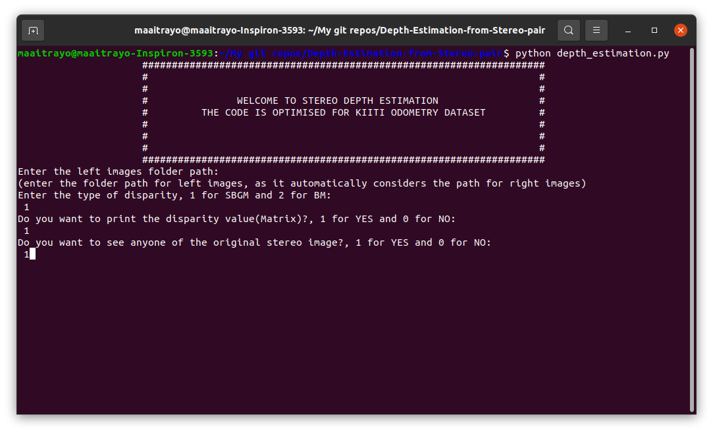
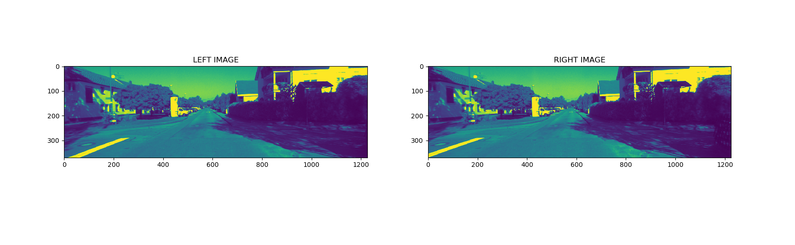
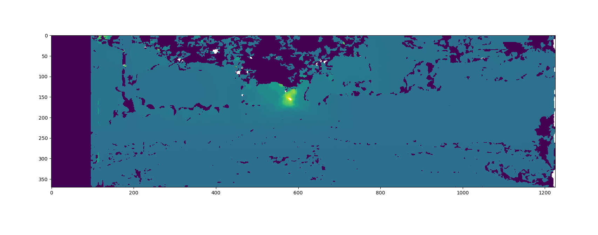
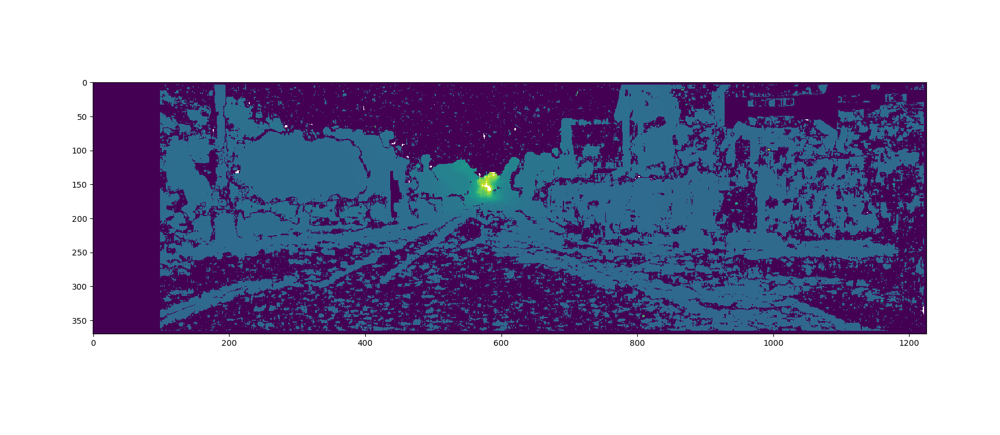
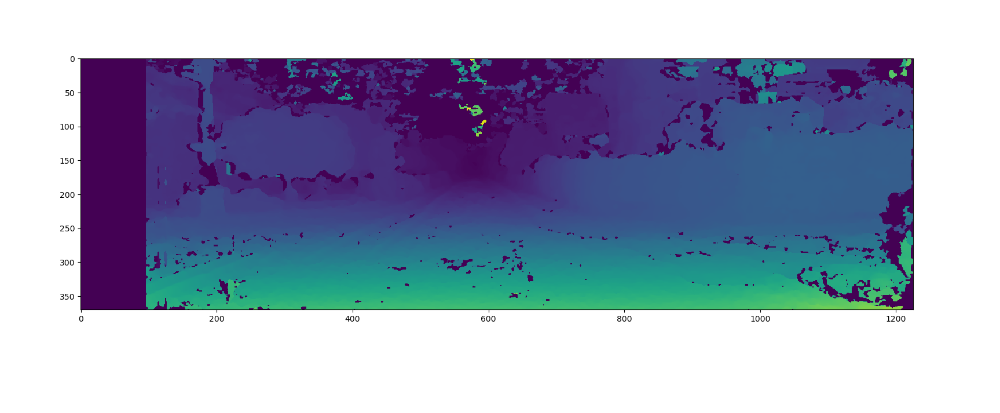
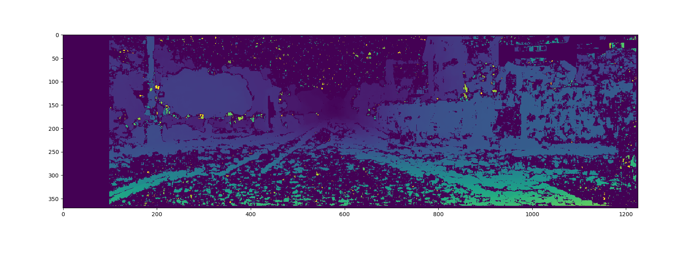

# DEPTH ESTIMATION FROM STEREO IMAGES OPTIMISED FOR KIITI ODOMETRY DATASET

## Depth output for Disparity computation type SGBM:

https://user-images.githubusercontent.com/76429346/133894234-84b75a96-144a-41cf-9fbb-57227900e07a.mp4

## Depth output for Disparity computation type BM:

https://user-images.githubusercontent.com/76429346/133894248-1c8e3be1-e1a8-4e3a-8872-47cb432b2610.mp4

## Dispaly window:


## Left and right images:


## Depth output for disparity type SGBM:


## Depth output for disparity type BM:


## SGBM Disparity output:


## BM Disparity output:


# Prerequisites:
1. python3 or higher
2. openCV for python
3. Matplotlib
4. KIITI odometry dataset

### If you donot have is installed, follow the following commands(for Ubuntu 20.04.3 LTS):
```bash
sudo apt update
```
```bash
sudo apt install libopencv-dev python3-opencv
```
```bash
sudo apt-get install python-matplotlib
```
```bash
http://www.cvlibs.net/datasets/kitti/eval_odometry.php
```
# To run the code:
```bash
git clone https://github.com/Maaitrayo/Depth-Estimation-from-Stereo-pair.git
```
```bash
cd Depth-Estimation-from-Stereo-pair
```
```bash
python depth_estimation.py
```
